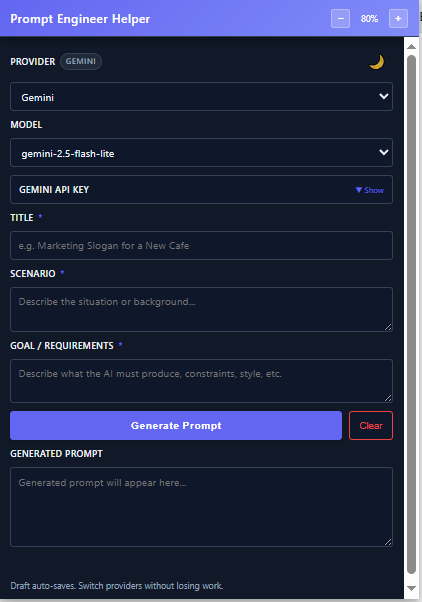

# Prompt Engineer Helper

> A browser extension for generating high-quality, structured prompts across multiple LLM providers (Gemini, OpenAI, Anthropic).



## 📋 Table of Contents
- [Features](#features)
- [How It Works](#how-it-works)
- [Installation](#installation)
- [Usage](#usage)
- [Supported Providers](#supported-providers)
- [UI Overview](#ui-overview)
- [Technical Details](#technical-details)
- [Use Cases](#use-cases)
- [Development](#development)
- [Contributing](#contributing)
- [License](#license)

---

## ✨ Features

- 🔌 **Multi-provider support** - Gemini, OpenAI (ChatGPT), Anthropic (Claude)
- 📋 **Model selector** - Pre-populated dropdowns with popular models per provider
- 🔐 **Collapsible API key section** - Hidden by default with show/hide and copy features
- 💾 **Auto-save drafts** - Title, Scenario, Goal, and output persist automatically
- 🌙 **Theme toggle** - Dark/Light modes with persisted preference
- 🔍 **Zoom controls** - UI scaling from 70% to 150%
- 📦 **Provider-specific storage** - Separate API keys and model preferences
- 🎨 **Modern UI** - Gradient header, responsive layout, clean design
- 🗑️ **Clear button** - Quick reset for all draft fields
- 🎯 **Meta-prompt generation** - Creates prompts for other AIs without solving tasks directly

---

## 🔄 How It Works

1. **Provide** three key inputs:
   - **Title** - High-level task name
   - **Scenario** - Context or background
   - **Goal/Requirements** - What the AI must produce, constraints, style

2. **Generate** - Extension sends a meta-instruction to your selected LLM

3. **Reuse** - Copy the generated prompt and paste it into any AI chat interface

The extension acts as a **prompt engineer**, creating instructions for another AI rather than solving the task itself.

---

## 📥 Installation

### Chrome (and Chromium-based browsers)

1. Clone or download this repository
   ```bash
   git clone https://github.com/jericosergio/prompt-engineer-browser-extension.git
   ```

2. Open Chrome and navigate to `chrome://extensions/`

3. Enable **Developer Mode** (toggle in top-right)

4. Click **Load unpacked** and select the `prompt-engineer-extension` folder

5. The extension icon will appear - click it to open the popup

---

## 🚀 Usage

### Quick Start

1. **Select Provider** - Choose Gemini, OpenAI, or Anthropic
2. **Choose Model** - Pick from pre-populated model options
3. **Configure API Key** (first time only):
   - Click "▼ Show" to expand the API Key section
   - Paste your API key (stored locally)
   - Use "👁 Show" to toggle visibility or "📋 Copy" to copy
4. **Fill Prompt Details**:
   - **Title**: e.g., "Marketing Slogan for Coffee Shop"
   - **Scenario**: Provide context and background
   - **Goal/Requirements**: Specify output format, constraints, style
5. **Generate** - Click button and wait for response
6. **Copy & Use** - Copy output and paste into any AI chat
7. **Clear** - Reset all fields when starting fresh
8. **Adjust UI** - Use +/− zoom controls (70%-150%)
9. **Toggle Theme** - Click 🌙/☀️ icon

---

## 🤖 Supported Providers

| Provider | Endpoint | Models Available |
|----------|----------|------------------|
| **Gemini** | `generateContent` | `gemini-2.0-flash-exp`, `gemini-2.5-flash-lite`, `gemini-1.5-flash`, `gemini-1.5-pro` |
| **OpenAI** | `chat/completions` | `gpt-4o`, `gpt-4o-mini`, `gpt-4-turbo`, `gpt-3.5-turbo` |
| **Anthropic** | `messages` | `claude-3-5-sonnet-latest`, `claude-3-5-haiku-latest`, `claude-3-opus-latest` |

**Extending Support**: Add more providers (Mistral, Cohere, etc.) by:
1. Adding `<option>` in `popup.html`
2. Extending `callLLM` in `popup.js` with new handler
3. Adding host permission in `manifest.json`

---

## 🖥️ UI Overview

### Header
```
┌─────────────────────────────────────────────────┐
│ Prompt Engineer Helper        [−] 100% [+] 🌙  │
└─────────────────────────────────────────────────┘
```
- Title, zoom controls (+/−), theme toggle

### Provider & Model Selection
```
Provider [gemini]                    Model
┌──────────────────────────┐    ┌──────────────────────┐
│ Gemini              ▼    │    │ gemini-2.5-...   ▼  │
└──────────────────────────┘    └──────────────────────┘
```

### API Key Section (Collapsible)
```
┌─────────────────────────────────────────────────┐
│ GEMINI API KEY                      ▼ Show      │ ← Click to expand
└─────────────────────────────────────────────────┘
```
Expanded:
```
┌─────────────────────────────────────────────────┐
│ GEMINI API KEY                      ▲ Hide      │
│ ┌─────────────────────────────────────────────┐ │
│ │ ●●●●●●●●●●●●●●●●●●●●●●●●●●●●●●●●●●●●●●●●● │ │
│ └─────────────────────────────────────────────┘ │
│ [👁 Show]  [📋 Copy]                            │
└─────────────────────────────────────────────────┘
```

### Input Fields
```
TITLE *
┌─────────────────────────────────────────────────┐
│ Email Subject Lines for Newsletter              │
└─────────────────────────────────────────────────┘

SCENARIO *
┌─────────────────────────────────────────────────┐
│ Monthly tech newsletter with 10k subscribers... │
└─────────────────────────────────────────────────┘

GOAL / REQUIREMENTS *
┌─────────────────────────────────────────────────┐
│ Generate 5 catchy subject lines under 60 chars  │
└─────────────────────────────────────────────────┘
```

### Action Buttons & Output
```
┌──────────────────────────────────┬──────────────┐
│      Generate Prompt             │   Clear      │
└──────────────────────────────────┴──────────────┘

GENERATED PROMPT
┌─────────────────────────────────────────────────┐
│ You are an expert copywriter specializing in... │
└─────────────────────────────────────────────────┘
Status: Done. You can copy the prompt above.
```

---

## 🛠️ Technical Details

### Architecture
- **Manifest V3** - Latest Chrome extension standards
- **No dependencies** - Pure HTML/CSS/JS
- **Direct API calls** - Fetch requests to provider endpoints
- **Chrome Storage API** - `storage.sync` for cross-device persistence

### File Structure
```
prompt-engineer-extension/
├── manifest.json          # Extension manifest (MV3)
├── popup.html             # UI with embedded CSS
├── popup.js               # Main logic and API handlers
├── LICENSE                # MIT License
└── README.md              # This file
```

### Storage Keys
| Key | Purpose |
|-----|---------|
| `llmProvider` | Current provider (gemini, openai, anthropic) |
| `apiKey_[provider]` | Provider-specific API keys |
| `model_[provider]` | Last selected model per provider |
| `draft_title`, `draft_scenario`, `draft_goal`, `draft_output` | Auto-saved fields |
| `theme` | UI theme (`dark` or `light`) |
| `zoom` | UI zoom level (0.7 to 1.5) |

### Key Features Implementation

**Auto-save**: 400ms debounced saves on input/blur events

**Zoom**: CSS `zoom` property with dynamic dimension adjustment
```javascript
function applyZoom(zoom) {
    document.body.style.zoom = zoom;
    const adjustedWidth = Math.round(baseWidth / zoom);
    const adjustedHeight = Math.round(baseHeight / zoom);
    document.body.style.width = `${adjustedWidth}px`;
    document.body.style.height = `${adjustedHeight}px`;
}
```

**Theme**: CSS variables swap for dark/light modes
```css
:root { --bg: #111827; --text: #f1f5f9; --accent: #6366f1; }
.light { --bg: #ffffff; --text: #0f172a; }
```

---

## 💡 Use Cases

<details>
<summary><strong>1. Product Description Generator</strong></summary>

**Input:**
- Title: "Product Description Writer"
- Scenario: "E-commerce site selling eco-friendly products"
- Goal: "Write SEO-friendly descriptions, 150-200 words, include benefits"

**Output:**
```
You are an expert e-commerce copywriter specializing in eco-friendly products.

Your task is to write product descriptions with the following requirements:
- Length: 150-200 words
- SEO-optimized with relevant keywords
- Highlight environmental benefits
- Include customer pain points and solutions
- Use persuasive but authentic tone
- End with a clear call-to-action

Format: Plain text, paragraph style
Constraints: Avoid greenwashing, use specific facts
```
</details>

<details>
<summary><strong>2. API Documentation Generator</strong></summary>

**Input:**
- Title: "API Documentation Generator"
- Scenario: "RESTful API with 20+ endpoints for SaaS platform"
- Goal: "Document each endpoint with examples, params, responses"

**Output:**
```
You are a technical writer creating API documentation.

For each endpoint provided, generate comprehensive documentation including:
1. Endpoint path and HTTP method
2. Brief description (1-2 sentences)
3. Request parameters (query, path, body) with types and descriptions
4. Response schema with example JSON
5. Possible error codes and meanings
6. Usage example in cURL and JavaScript

Style: Clear, concise, developer-friendly
Format: Markdown with code blocks
```
</details>

<details>
<summary><strong>3. Social Media Content Calendar</strong></summary>

**Input:**
- Title: "LinkedIn Post Scheduler"
- Scenario: "B2B SaaS company targeting CTOs and VPs"
- Goal: "Generate 10 post ideas with drafts, one per week"

**Output:**
```
You are a B2B social media strategist focused on LinkedIn.

Create a 10-week content calendar with:
- Post theme/topic (relevant to CTOs/VPs)
- Draft post text (120-150 words)
- 3-5 relevant hashtags
- Suggested posting day/time
- Call-to-action (comment, share, visit link)

Themes to cover: Industry trends, Leadership insights,
Product updates, Case studies, Thought leadership

Tone: Professional yet approachable
Constraints: No sales pitch in every post
```
</details>

---

## 👥 Who Benefits

| Audience | Benefits |
|----------|----------|
| **Developers** | API testing, prompt iteration, reusable templates |
| **Content Creators** | Consistent structure, quality control, time savings |
| **Researchers** | Experimentation, reproducible templates, collaboration |
| **Educators** | Teaching tool, student projects, consistent grading |

---

## 🔧 Development

### Setup
No build step required - pure HTML/JS/CSS.

### Testing
1. Make changes to files
2. Go to `chrome://extensions/`
3. Click refresh icon on extension card
4. Open popup to test changes

### Adding Models
Edit `modelOptions` object in `popup.js`:
```javascript
const modelOptions = {
    gemini: ["model-1", "model-2"],
    openai: ["model-1", "model-2"],
    anthropic: ["model-1", "model-2"]
};
```

### UI Customization
All styles in `popup.html` `<style>` block. CSS variables control theming:
- `--bg`, `--text`, `--accent`, `--border` for colors
- `.light` class overrides for light mode

---

## 🌟 Features in Detail

### Security & Privacy
- 🔒 Keys stored locally via `chrome.storage.sync`
- 🚫 No third-party transmission
- ⚠️ Never publish with embedded keys
- 🔐 Collapsible section hides keys by default

### Accessibility
- ⌨️ Full keyboard navigation
- 🔍 Zoom support (70%-150%)
- 🌓 High contrast light mode
- 📢 Screen reader friendly with semantic HTML

### Performance
- ⚡ Fast load (~15KB total)
- 💨 Instant UI (local-first)
- 💾 Efficient debounced saves
- 🎯 Direct API calls (no backend)

---

## 🌐 Browser Compatibility

| Browser | Status | Notes |
|---------|--------|-------|
| ✅ Chrome | Tested & Supported | Fully compatible |
| ✅ Edge | Supported | Chromium-based |
| ✅ Brave | Supported | Chromium-based |
| ✅ Opera | Supported | Chromium-based |
| ⚠️ Firefox | Requires MV3 adjustments | Manifest conversion needed |
| ⚠️ Safari | Requires conversion | Safari extension format needed |

---

## 🗺️ Roadmap

- [ ] Firefox and Safari versions
- [ ] Prompt history panel with export
- [ ] Template library with categories
- [ ] Streaming API support
- [ ] Advanced parameter controls (temperature, max tokens)
- [ ] Import/export settings
- [ ] Keyboard shortcuts
- [ ] Multi-language UI (i18n)
- [ ] Chrome Web Store publication

---

## 🤝 Contributing

We welcome contributions! Here's how:

1. **Fork** the repository
2. **Create** a feature branch
   ```bash
   git checkout -b feature/amazing-feature
   ```
3. **Commit** your changes
   ```bash
   git commit -m "Add amazing feature"
   ```
4. **Push** to your branch
   ```bash
   git push origin feature/amazing-feature
   ```
5. **Open** a Pull Request

### Guidelines
- Keep UI consistent with existing design
- Avoid storing sensitive information beyond API keys
- Test thoroughly before submitting PR
- Update documentation for new features

---

## 📄 License

This project is licensed under the **MIT License** - see the [LICENSE](LICENSE) file for details.

---

## ⚠️ Disclaimer

**Use at your own risk.** API usage may incur costs depending on the provider. Monitor usage and follow each provider's terms of service.

---

## 🙏 Acknowledgments

Thanks to the open ecosystems of **Gemini**, **OpenAI**, and **Anthropic** for enabling flexible prompt engineering workflows.

---

## 📞 Community & Support

- **Repository**: [github.com/jericosergio/prompt-engineer-browser-extension](https://github.com/jericosergio/prompt-engineer-browser-extension)
- **Issues**: [Report bugs or request features](https://github.com/jericosergio/prompt-engineer-browser-extension/issues)
- **Discussions**: Share your use cases and prompts
- **Star** the repo if you find it useful!

---

<div align="center">

**Built with ❤️ for the prompt engineering community**

[⬆ Back to Top](#prompt-engineer-helper)

</div>
